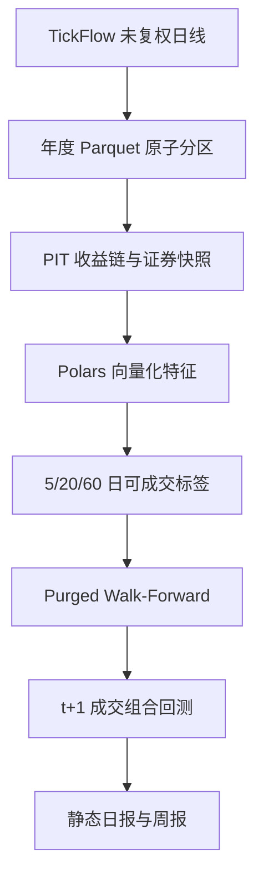

# 方法与审计说明

## 为什么默认是 LightGBM

日频 A 股横截面属于“样本很多、特征中等、非线性与缺失值并存”的表格问题。对 6 核 CPU、
RTX 3060 6GB、16GB 内存而言，CPU LightGBM 通常能给出最好的稳健性/训练时间/内存比。
Ridge 不是为了追求最高收益，而是用来检查复杂模型是否真的产生了增量。CatBoost GPU
保留为安装 `.[gpu]` 后的挑战模型，不作为 Windows 默认运行链路的硬依赖。

## 信息流

GUI 只启动 CLI 子进程；所有数学、状态和费用逻辑都在 `src/neural_alpha_ashare/` 中，
因此命令行、GUI、测试和定时任务不会产生四套口径。

## 标签

对信号日 `t` 和期限 `h`，原始可成交收益定义为：

\[
r_{t,h}=\frac{Close_{t+h}}{Open_{t+1}}-1
\]

若 `t+1` 停牌、无成交或开盘已经封在涨停价，标签置空。按信号日、板块和流动性桶减去
同组中位数，再在当日横截面中转成 `[-1, 1]` 的秩目标。三个期限独立训练；预测值不能
直接相加，而是先在各自当日横截面排名，再按 `0.2/0.5/0.3` 合成。

`label_available_date_h` 记录标签何时完整可见。训练和验证过滤器使用这个字段，而不是仅仅
看信号日期。

## 切分

- 禁止随机 train/test split。
- 每折顺序是训练区、purge、验证区、embargo、测试区。
- 最长标签为 60 个交易日，默认 purge 也是 60 日。
- 验证集参与 early stopping；测试集只生成冻结模型的样本外预测。
- 训练读取通过 LazyFrame 日期谓词和 `tail(max_train_rows)` 下推，避免把全历史宽表一次性装入内存。

## A 股成交规则

- 只做多，默认候选为沪深主板、创业板和科创板；北交所单独关闭。
- 最少 240 个交易日历史，20 日成交额中位数至少 2,000 万元。
- 排除 ST、停牌、无量和一字涨停；买入时拒绝开盘涨停，卖出时拒绝开盘跌停。
- 收盘信号最早下一交易日开盘执行，卖出遵守 T+1，数量按 100 股向下取整。
- 新进入 Top 15；持仓跌出 Top 60 或超过 60 个交易日才退出，降低边界抖动换手。
- 单股上限 10%，单次成交额不超过事前已知 20 日成交额中位数的 2%。
- 冲击成本为参与率的平方根函数，并封顶 30 bps；另加固定 5 bps 滑点。
- 股票买卖佣金均为 `0.00008499999`，基金为 `0.00005000001`，最低佣金为零；
  股票卖出另收 `0.0005` 印花税。

## 幸存者偏差状态

TickFlow 目录快照从本项目第一次运行后才开始积累。某一历史日期若没有当时或更早观察到的
目录快照，系统根据实际出现的行情代码构建研究行，但将对应年度和报告标记为 `DEGRADED`。
它不会把今天的名称/ST 状态倒填到过去，也不会把该结果标成严格无幸存者偏差。随着本地快照
持续积累，覆盖日期会被标记为 `PIT`。

## 16GB 内存策略

- 原始和研究表按年分区，Zstandard 压缩，连续特征写为 `float32`。
- 年度特征构建只读取目标年、400 个自然日回看和标签所需前看窗口。
- 模型读取只投影必需列；默认最多 180 万训练行和 40 万验证行。
- Walk-Forward 每折预测立即落盘，最后用 LazyFrame 拼接，不在 Python 列表中累计全历史宽表。
- LightGBM 使用 6 个物理核、列优先直方图和 63 个 bins；系统内存软上限为 11.5GB。

这些限制优先保护操作系统和文件缓存。若实测仍发生换页，应先降低 `max_train_rows`，而不是
减少 purge 或放宽 PIT 约束。
